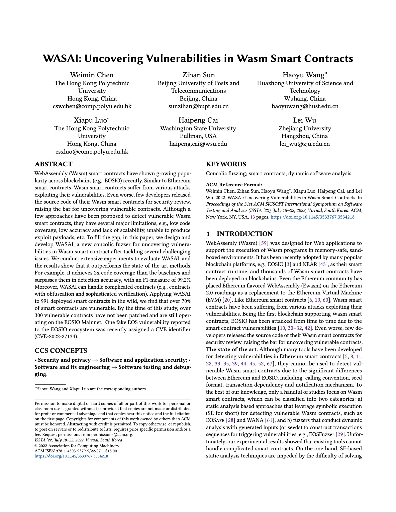

# WASAI

<a href="https://conf.researchr.org/details/issta-2022/issta-2022-technical-papers/8/WASAI-Uncovering-Vulnerabilities-in-Wasm-Smart-Contracts">  </a>

WASAI is a concolic fuzzer for identifying vulnerabilities in Wasm smart contracts, taking EOSIO as the mainly Wasm favored blockchain. In particular, WASAI builds symbolic constraints along the execution traces of smart contracts and solves them to guide the fuzzing. The fuzzer is based on our [paper](https://conf.researchr.org/details/issta-2022/issta-2022-technical-papers/8/WASAI-Uncovering-Vulnerabilities-in-Wasm-Smart-Contracts), [recording](TBD):

```
@inproceedings{Wei2022Wasai,
  author = {Weimin Chen, Zihan Sun, Haoyu Wang, Xiapu Luo, Haipeng Cai, Lei Wu},
  booktitle = {Proceedings of the 31st ACM SIGSOFT International Symposium on Software Testing and Analysis (ISSTA)},
  month = jul,
  title = {WASAI: Uncovering Vulnerabilities in Wasm Smart Contracts},
  year = {2022}
}
```

## Architecture

```
|-- fuzz_benchmark.py               large scale analysis 
|—— bin                          
| |—— fuzz.py                       entry file
| |—— complicatedVerification.py    RQ3-1
| |—— reduceCov.py                  RQ3-2
|—— symzzer         
| |—— fuzzActions.py                main entry
| |—— argumentFactory.py            generate seeds
| |—— logAnalyzer.py                feedback
| |-- tainter
| | |-- analysis.py                 constratins generation
| | |-- wasabiHooker.py             engine hooks
| | |-- emulator.py                 symbolic execution engine
| | |-- memory.py                   memory model
| | |-- opcodes.py                  opcode table
| | |-- utils.py          
| |-- setting.py
| |-- utils.py
```
## Getting Started

1.   set environment

WASAI should run well on a service with Ubuntu 18.04 or Ubuntu 20.04.
Please download [Docker](https://docs.docker.com/get-docker/) first.
```bash
git clone https://github.com/wasai-project/wasai.git && cd wasai # download the code
sudo docker build -t localhost/client-eos:wasai .
sudo docker run --rm -ti  localhost/client-eos:wasai # run a docker container
```

2. run example

   Execute bin/fuzz.py to get the result. `python -m bin.fuzz <wasmPath> <abiPath> <contractName> <timeout> <fuzzCnt> <saveResult>`

```bash
# in the docker container 
python3 -m bin.fuzz ./examples/batdappboomx/batdappboomx.wasm ./examples/batdappboomx/batdappboomx.abi batdappboomx 300 300  ./rt/ --detect_vuls 020000
```

WASAI should report a Fake EOS vulnerablity.

```
[+] Executed EOSPONSER# 68
- Checking Fakeos
[+] final report: {
    "name": "batdappboomx",
    "time": "5.45s",
    "bugs": [
        2
    ],
    "lava_eos": [],
    "lava_notif": [],
    "logLifes": []
}
```
# More Benchmark

`https://drive.google.com/file/d/1z1rd3o0o6zoYVNcKXpnHWqDLn4EwdcP-/view?usp=sharing`
`https://github.com/gongbell/EOSFuzzer/tree/master/dataset/binaryContracts`

# Authors

[Zihan Sun](https://github.com/Al0ha0e), [Weimin Chen](https://github.com/Kenun99)

# License

[License MIT](LICENSE)

